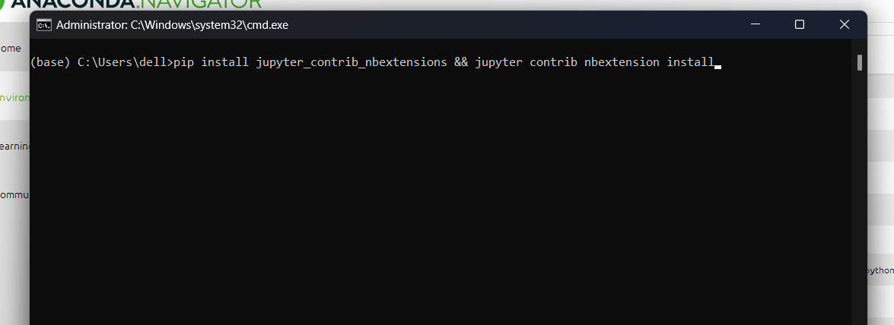

# Task 1
## Table of Contents
- [Description](#description)
- [Enable auto-completion](#enable-auto-completion)
- [Display run-time](#display-run-time)

## Description
How to enable auto-completion (without pressing `tab`) and display execution time in Jupyter Notebook.

## Enable auto-completion
### Description
The following 2 methods will enable auto-completion without pressing **Tab**:
- [How to enable auto-completion 1](#how-to-enable-auto-completion-1)
- [How to enable auto-completion 2](#how-to-enable-auto-completion-2)

### How to enable auto-completion 1
#### Open Anaconda Navigator
You can open it by searching for it in windows search bar

#### Go to Environment tab and select the desired Conda Environment
In this case it is base(root)

#### Click on the green button shown below and click on Open terminal

#### Paste the following command in the terminal and press Enter
`pip install jupyter_contrib_nbextensions && jupyter contrib nbextension install`

#### After it finishes downloading the necessary packages Open Jupyter notebooks, it will show an additional tab called *Nbextensions*

#### Press on the tab then uncheck the marked checkbox

#### Search in the filter for `hinterland` then check the highlighted checkbox 
This will enable Hinterland which is the extension for auto-completion without pressing tab

[(return to top)](#task-1)

### How to enable auto-completion 2
#### Open new jupyter notbook and run the following commands in separate cells
`!pip install jupyter_contrib_nbextensions && jupyter contrib nbextension install --user`

`!jupyter nbextension enable hinterland/hinterland`

[(return to top)](#task-1)

### Display Run-time
#### Follow the [first method](#how-to-enable-auto-completion-1) of installing the auto-completion extension till [this step](#search-in-the-filter-for-hinterland-then-check-the-highlighted-checkbox), where you will instead search for `executetime` and enable it.

[(return to top)](#task-1)
