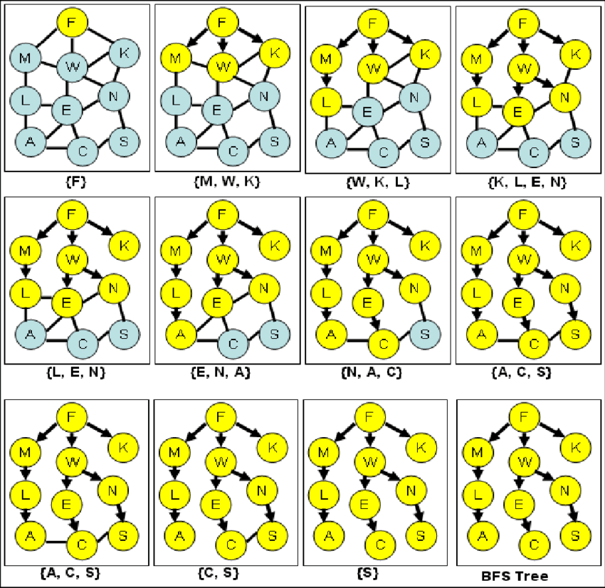

# Session 6 Tasks
## Task 1
### Description
Research DFS and BFS
### Solution
#### DFS
Depth-first search (DFS) is an algorithm for traversing or searching tree or graph data structures. The algorithm starts at the root node (selecting some arbitrary node as the root node in the case of a graph) and explores as far as possible along each branch before backtracking.

#### BFS
Breadth first search (BFS) is an algorithm for searching a tree or graph data structure for a node that meets a set of criteria. It starts at the tree’s root or graph and searches/visits all nodes at the current depth level before moving on to the nodes at the next depth level123. BFS uses a queue data structure to keep track of the nodes to be visited and a visited array to mark the nodes that have been visited.

